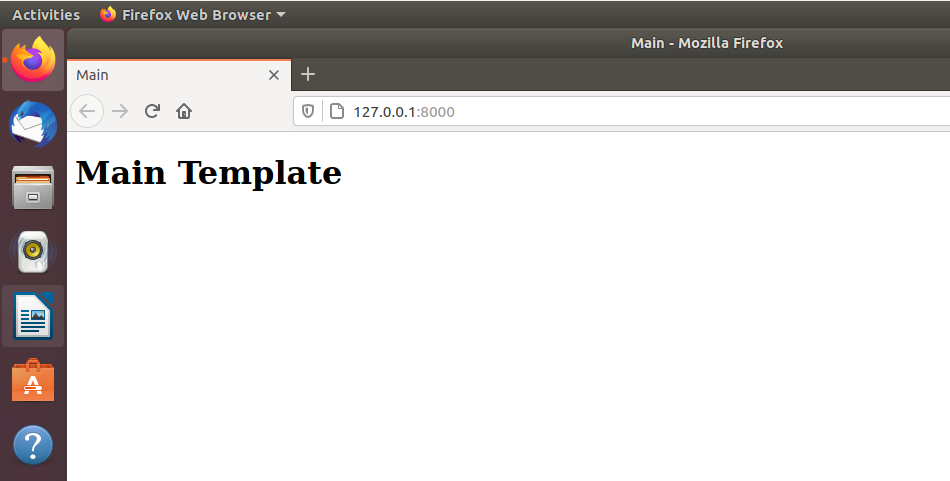
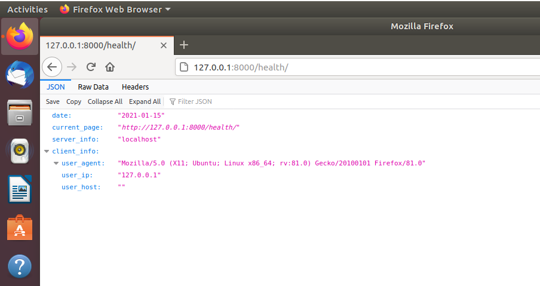

## Лабораторна робота №3
#### Хід роботи
+ ініціалізація `pipenv`:
```
pipenv --python 3.8
```
+ встановлення `django`:
```
pipenv install django
```
+ створюємо темплейт проекту
```
pipenv run django-admin startproject my_site
```
+ запуск сервера
```
pipenv run python manage.py runserver
```
+ створення основного темплейту
```
pipenv run python manage.py startapp main
```
+ створено папку `main/templates/` та додано `index.html`, `main/urls.py`
+ задано Django frameworks його назву та шлях, де шукати веб-сторінки
+ встановлення модуля `requests`
```
pipenv install requests
```
+ додано функціонал який виводить повідомлення про недоступність сайту
+ додано функціонал запуску раз у хвилину та роботи в бекграунді
+ додано скрипти у `Pipfile`

+ вигляд основного темплейту

+ вигляд сторінки `health`
