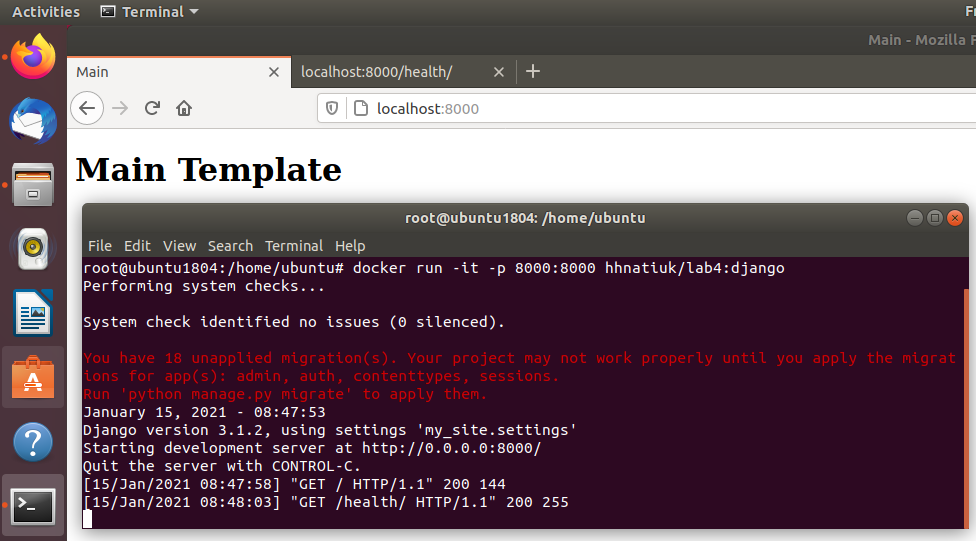
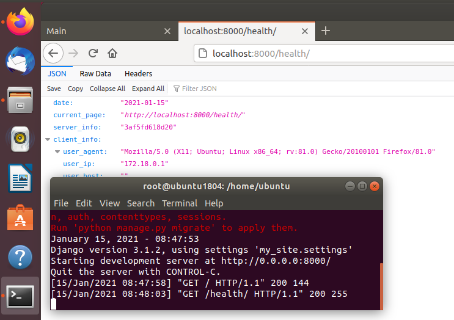

## Лабораторна робота №4
#### Хід роботи:

+ Перенаправлення виводу команд у файл `my_work.log`
```
docker -v >> my_work.log;
docker --help >> my_work.log;
docker run docker/whalesay cowsay Docker is fun >> my_work.log;
```

+ Білд django імеджа з `Dockerfile`
```
docker build -t hhnatiuk/lab4:django .
```

+ Завантаження django імеджа на `DockerHub`

```
docker login
docker push hhnatiuk/lab4:django
```

+ Білд моніторинг імеджа із `Dockerfile.monitoring`

```
docker build -t hhnatiuk/lab4:monitoring -f Dockerfile.monitoring . 
```
+ Запуск основного імеджа
```
docker run -it -p 8000:8000 hhnatiuk/lab4:django
```

+ Запуск моніторинг імеджа
```
docker run -d hhnatiuk/lab4:monitoring
```

+ Перевірка правильної роботи




+ Завантаження нового імеджа на `DockerHub`
```
docker push hhnatiuk/lab4:monitoring
```

+ Запуск створених імедів із монтуванням тому:
```
docker run -it -p 8000:8000 hhnatiuk/lab4:django
docker run -it --net=host -v /home/ubuntu/lab4:/app hhnatiuk/lab4:monitoring
```

## Мій докер id [docker.profile](https://hub.docker.com/u/hhnatiuk)
## Мій репозиторій на докері [docker.repo](https://hub.docker.com/repository/docker/hhnatiuk/lab4)