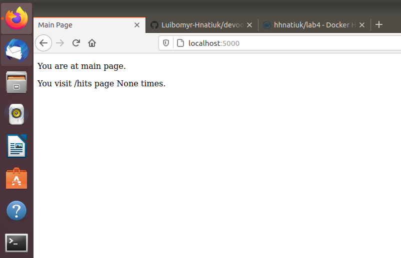
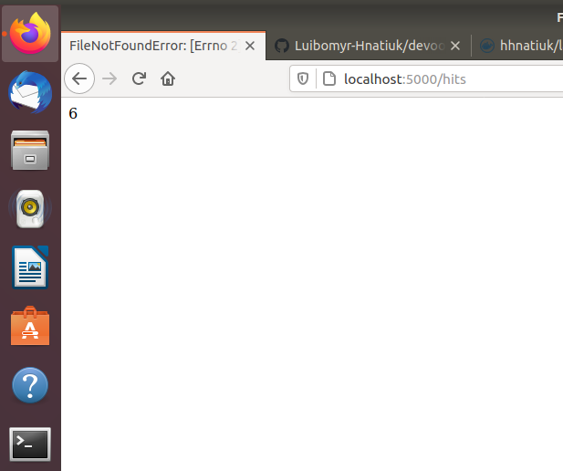
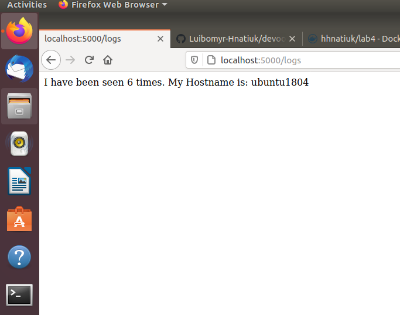
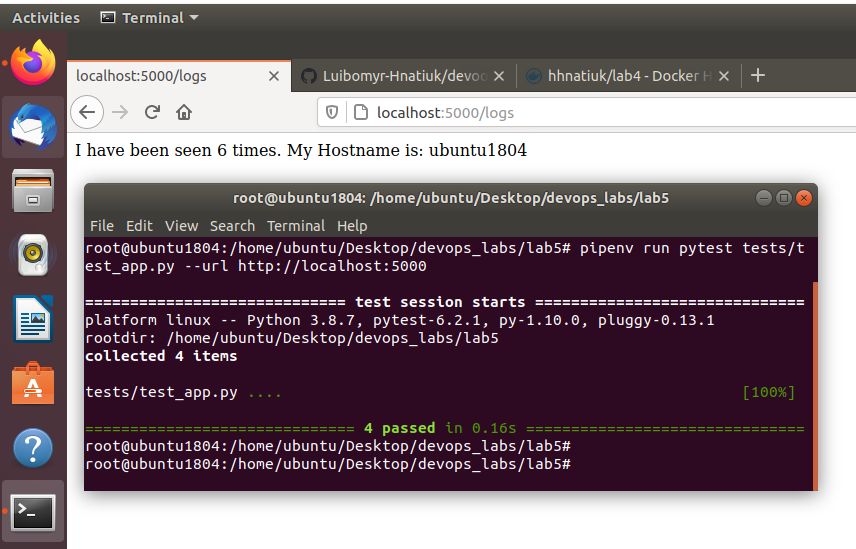
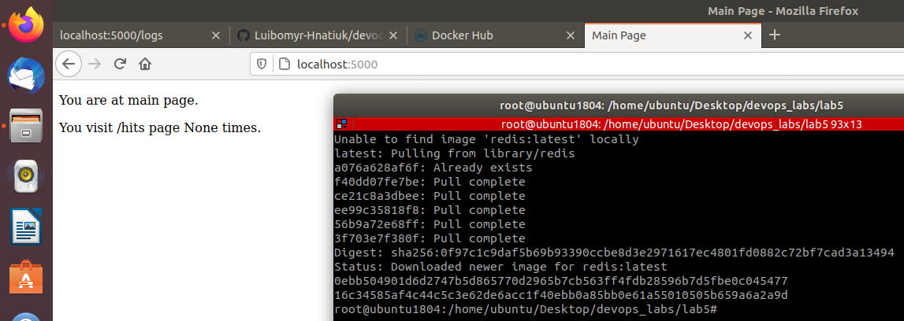
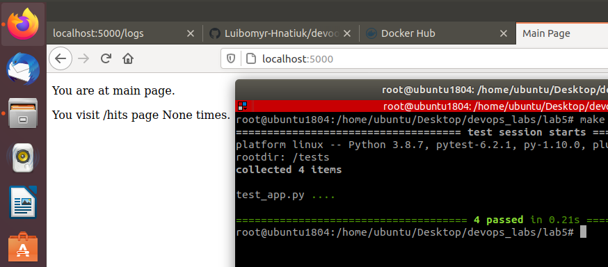
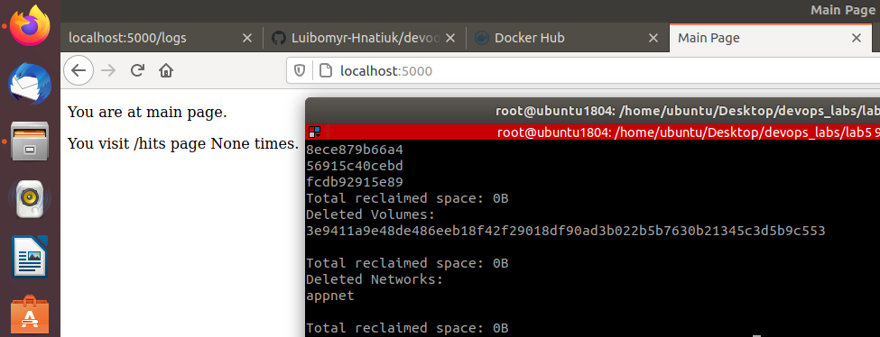
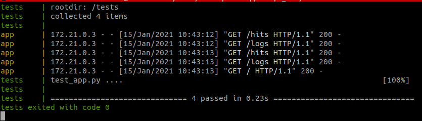
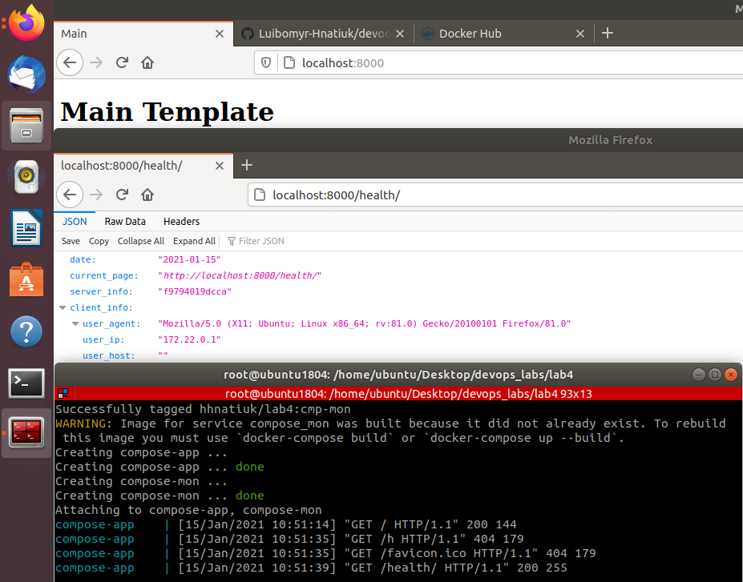

## Лабораторна робота №5
#### Хід роботи

+ створення віртуального середовища
```
pipenv --python 3.8
```
+ встановлення залежностей 
```
pipenv install -r requirements.txt
```
+ запуск програми
```
pipenv run python app.py
```
### /

### /hits

### /logs
  
+ запуск тестів
```
pipenv run pytest test_app.py --url http://localhost:5000
```
### тестування пройшло успішно



+ Make PHONY - задання псевдоцілі.
+ Make run - запуск імеджів.
+ Make test-app - запуск тестування.
+ Make docker-prune - очищення середовища docker.



+ створив директиву `push` в Makefile для завантаження імеджів у Docker Hub репозиторій 
+ створив директиву `remove` в Makefile яка автоматизує процес видалення імеджів
+ `make remove` виводить порожній рядочок -> всі імеджі очищено
```
REPOSITORY TAG IMAGE ID CREATED SIZE
```
+ створення проекту засобами docker-compose:
```
docker-compose -p Lab5 up
```

+ завантаження docker-compose імеджів до репозиторію:
```
docker-compose push
```
#### docker-compose має значно більше опцій для налаштування проектів, тому вважаю його більш підходящим 
  
+ створив docker-compose.yaml для лабораторної №4.
+ запуск Django проекту
```
docker-compose -p Lab4 up
```

+ завантаження Django імеджів до репозиторію `lab4` 
```
docker-compose push
```
+ новий docker-compose завантажено до 4ї ЛР.

## Мій докер id [docker.profile](https://hub.docker.com/u/hhnatiuk)
## Мій репозиторій на докері до ЛР5 [docker.repo](https://hub.docker.com/repository/docker/hhnatiuk/lab5)
## Мій репозиторій на докері до ЛР4 [docker.repo](https://hub.docker.com/repository/docker/hhnatiuk/lab4)